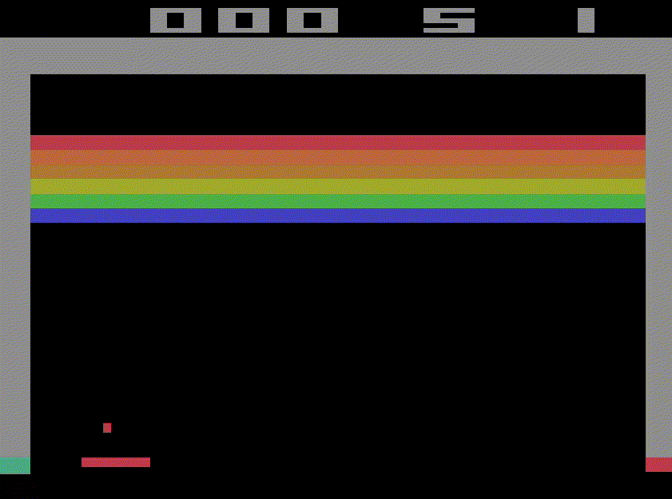

Started project using the example from Arcade Learning Enviornment



Setup

```
python3.11 -m venv .env
source .env/bin/activate
pip install -r requirements.txt
```

You can download an LLM or use an OpenAI API token. If you want to download one, the easiet option would probably be Llama 3 1B LLamafile. The 1B version is very small and probably won't do very good but you can still use it to test.

  - [Llama 3.1 1B Llamafile](https://huggingface.co/Mozilla/Llama-3.2-1B-Instruct-llamafile/blob/main/Llama-3.2-1B-Instruct.Q6_K.llamafile?download=true)
  - [Llamafile info](https://github.com/Mozilla-Ocho/llamafile)

Running

First run the llamafile by renaming the file to have `.exe` on the end then double click it. 

Then you can run the atari game which will talk to the llamafile with this python script:

```
python video-with-text.py
```

It will take a little while to run. When it is done, it will generate an MP4 file in the same folder as the python script where you can see how the LLM did.


